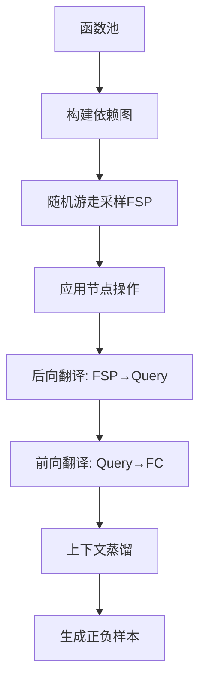

# MAGNET 论文深度分析报告

## 📄 论文基本信息

- **标题**: MAGNET: Multi-turn Tool-use Data Synthesis and Distillation via Graph Translation
- **文件**: 2503.07826v1.pdf
- **页数**: 22页
- **研究方向**: 多轮工具调用数据合成与蒸馏

---

## 🎯 研究背景与动机

### 核心问题

当前大语言模型（LLM）在**多轮函数调用（Multi-turn Function Calling）**场景下表现不佳：
- 最佳专有模型在 BFCL-v3 多轮测试中仅达到 **47.62%** 成功率
- 部分开源模型成功率仅约 **10%**

### 多轮函数调用的主要挑战

论文通过 Figure 1 展示了多轮对话中的典型挑战：

1. **嵌套函数调用（Nested FC）**
   - 需要在同一轮中调用多个相互依赖的函数
   - 例如：先获取距离，再设置导航

2. **长距离输出依赖（Long Output Dependencies）**
   - 跨多轮对话引用历史信息
   - 需要记住并使用之前轮次的输出结果

3. **无关函数干扰（Irrelevant Functions）**
   - 上下文中存在大量不相关的函数
   - 模型需要准确识别并忽略这些干扰

4. **信息缺失（Missing Information）**
   - **Miss-func**: 缺少必要的函数
   - **Miss-params**: 缺少必要的参数

### 常见错误类型

- **Error 1**: 未能回忆历史信息（如 booking_id）
- **Error 2**: 调用错误的函数
- **Error 3**: 幻觉参数值（hallucinate values）

---

## 💡 核心创新：MAGNET 方法

### 方法概述

**MAGNET** = **M**ulti-turn function-c**A**lling data synthesis with **G**raph Tra**N**slation

核心思想：基于**图结构**和**迭代前后向翻译**合成高质量多轮函数调用数据

### 关键组件

#### 1. 工具依赖图（Local Dependency Graph）

**构建原理**：
- 将函数组织为图中的节点
- 当源节点的输出与目标节点的输入相关时，建立有向边
- 边表示函数之间的依赖关系

**依赖类型**：
- **Full**: 源函数输出可作为目标函数的完整输入
- **Partial**: 源函数输出可作为目标函数的部分输入
- **Prerequisite**: 源函数输出决定是否应调用目标函数
- **None**: 无依赖关系

#### 2. 函数序列路径（Function Signature Path, FSP）

**生成方法**：
- 在依赖图上进行随机游走（Random Walk）
- 采样相关的函数签名序列
- 形成初始的 FSP

#### 3. 节点操作（Node Operations）

为了覆盖多轮对话中的各种挑战，设计了三种数据增强操作：

##### **Insert 操作**
- **目的**: 创建有依赖关系的函数调用场景
- **类型**:
  - **Short dependency**: 同一轮内的函数依赖
  - **Long dependency**: 跨轮次的函数依赖
- **示例**: 
  - 用户只说"Navigate to San Mateo"
  - 模型需要隐式调用 `get_distance` 作为辅助函数

##### **Merge 操作**
- **目的**: 合并连续的轮次
- **效果**: 模拟单轮对话包含多个函数调用的场景
- **示例**: 
  ```
  turn0: [get_distance]
  turn1: [set_navigation]
  →
  turn0: [get_distance, set_navigation]
  ```

##### **Split 操作**
- **目的**: 创建信息缺失场景
- **效果**: 模型应表示拒绝调用的意图
- **示例**: `turn1: []` (无可用函数)

#### 4. 前后向翻译（Back-and-Forth Translation）

**后向翻译（Back-translation）**: FSP → Query
- 从函数签名序列生成用户查询
- 使用 LLM 模拟真实用户请求

**前向翻译（Forth-translation）**: Query → Function Calls
- 从查询生成可执行的函数调用
- 填充函数参数，确保可执行性

#### 5. 上下文蒸馏（Context Distillation）

**教师模型**: Gemini-1.5-pro-002

**正样本生成**：
- 将函数调用参考作为提示（hints）
- 确保生成高质量的正向轨迹

**负样本生成**：
- 选择包含错误的动作
- 故意添加错误提示
- 创建正负样本的明确对比

---

## 🔬 实验设计

### 数据集规模

- **SFT 数据**: 34K 轨迹
- **mDPO 数据**: 4,556 轨迹对

### 基础模型

- Qwen2.5-Coder-7B-instruct
- Qwen2.5-Coder-14B-instruct

### 训练策略

1. **监督微调（SFT）**
   - 全参数微调
   - Max length: 8,172
   - Warm up: 0.1
   - Optimizer: Adam
   - Learning rate: {1e-5, 5e-5}
   - Batch size: {64, 128}
   - Epochs: 1（最佳）

2. **多轮直接偏好优化（mDPO）**
   - 14B 模型使用 LoRA (rank=32, alpha=64)
   - 7B 模型全参数训练
   - Learning rate: {5e-7, 1e-6, 5e-6}
   - Batch size: {32, 64}
   - Beta: {0.1, 0.01, 0.3}

### 评估基准

#### BFCL-v3 (Berkeley Function Calling Leaderboard)
- 综合评估单步、多步、多轮场景
- 包含 miss-info 等边缘情况

#### ToolQuery
- 工具查询能力评估

---

## 📊 实验结果

### 主要成果

**MAGNET-14B-mDPO** 在 BFCL-v3 上：
- **排名**: 第 4 名
- **超越**: 教师模型 Gemini-1.5-pro-002
- **多轮场景提升**: 相比基础模型提升 **32.5 分**

### 性能对比

| 模型 | 多轮成功率 | 提升幅度 |
|------|-----------|---------|
| 基础模型 | ~10% | - |
| MAGNET-14B-SFT | ~30% | +20% |
| MAGNET-14B-mDPO | ~42.5% | +32.5% |
| Gemini-1.5-pro-002 | ~40% | - |

### 消融实验（Ablation Study）

验证了各组件的有效性：
1. **工具依赖图**: 提供结构化的函数关系
2. **节点操作**: 覆盖多轮对话的各种挑战
3. **上下文蒸馏**: 提高轨迹质量
4. **mDPO**: 通过偏好学习进一步提升性能

### 泛化能力

- 可以泛化到不同的基础模型
- 可以使用不同的教师模型
- 支持自我改进（使用基础模型自身作为教师）

---

## 🔍 技术细节

### 数据合成 Pipeline



### Prompt 设计

论文在附录中提供了详细的 prompt 模板：

1. **后向翻译 Prompt**
   - 角色扮演：模拟用户
   - 规则：不显式提及函数名
   - 要求：包含所有必需参数信息
   - 风格：自然对话，逻辑连贯

2. **前向翻译 Prompt**
   - 角色扮演：函数调用代理
   - 规则：使用原始函数名
   - 要求：填充所有必需参数
   - 限制：不超过 3 个并行调用

3. **评估 Prompt**
   - 5 种错误类型判断
   - 参数匹配验证
   - 冗余参数容忍

---

## 💪 方法优势

### 1. 可解释性强
- 基于图游走，每条轨迹都有明确的路径
- 节点操作清晰，易于理解和调试

### 2. 复杂度高
- 支持并行调用、长短依赖、信息缺失等复杂场景
- 通过节点操作灵活控制数据特性

### 3. 质量可控
- 使用强大的教师模型（Gemini-1.5-pro-002）
- 上下文蒸馏确保轨迹质量
- 正负样本对比学习

### 4. 可扩展性好
- 可以使用不同的教师模型
- 支持自我改进
- 泛化到不同基础模型

---

## 🎓 对你的研究的启发

### 直接相关性

你的论文草稿中提到的**创新点2**与 MAGNET 高度相关：

> "toucan的数据依赖于调用真实MCP合成数据，很费钱，而且依赖于random select...因此我们想在保留真实MCP tool的前提下，合成一批比toucan的多轮对话数据质量更高的数据。"

### 可借鉴的核心思想

1. **工具依赖图构建**
   - MAGNET 的图构建方法可以直接应用
   - 依赖类型分类（Full/Partial/Prerequisite）很有价值

2. **节点操作设计**
   - Insert/Merge/Split 三种操作覆盖了主要场景
   - 你可以在此基础上设计更多操作

3. **前后向翻译算法**
   - FSP → Query → Execution 的流程很完整
   - Prompt 设计可以参考

4. **数据增强策略**
   - 正负样本构建方法
   - 上下文蒸馏技术

### 差异化方向

你的工作可以在以下方面与 MAGNET 区分：

1. **真实 MCP 环境**
   - MAGNET 使用的是 StableToolBench 等合成函数
   - 你使用真实的 MCP servers，更具实用价值

2. **执行环境模拟**
   - 你设计了详细的 Python 代码生成和执行模拟
   - 包括 `call_external_api` 的 mock 机制

3. **拒绝策略数据**
   - 你的 miss-func 和 miss-params 数据生成算法更详细
   - 可以作为对 MAGNET 的补充

4. **工具分类**
   - 你的 Computation/Query/Action 三分类
   - 为不同类型工具设计不同的模拟策略

---

## 📌 关键要点总结

### 核心贡献

1. ✅ 提出基于图的多轮函数调用数据合成方法
2. ✅ 设计三种节点操作覆盖多轮对话挑战
3. ✅ 通过上下文蒸馏提高数据质量
4. ✅ 在 BFCL-v3 上达到 SOTA 性能

### 技术亮点

- 🔹 工具依赖图：结构化函数关系
- 🔹 随机游走：采样相关函数序列
- 🔹 节点操作：Insert/Merge/Split
- 🔹 前后向翻译：FSP ↔ Query ↔ FC
- 🔹 上下文蒸馏：正负样本对比学习

### 实验验证

- ⭐ 多轮场景提升 32.5 分
- ⭐ 超越教师模型 Gemini-1.5-pro-002
- ⭐ 排名 BFCL-v3 第 4 名
- ⭐ 消融实验验证各组件有效性

---

## 🔗 与你的研究的结合点

### 论文结构对应

| MAGNET 章节 | 你的论文对应部分 |
|------------|----------------|
| 工具依赖图构建 | 3.2.3 工具依赖图构建算法 |
| 节点操作 | 3.2.4 FSP数据增强 |
| 前后向翻译 | 3.2.6 后向-前向翻译算法 |
| 上下文蒸馏 | 可作为未来工作 |

### 引用建议

在你的论文中可以这样引用 MAGNET：

- **Related Work**: 介绍 MAGNET 的图方法和节点操作
- **Method**: 说明你的方法受 MAGNET 启发，但在真实 MCP 环境下实现
- **Comparison**: 对比 MAGNET 使用合成函数 vs 你使用真实 MCP
- **Ablation**: 参考 MAGNET 的消融实验设计

---

## 📖 推荐阅读顺序

1. **Introduction + Figure 1**: 理解问题和挑战
2. **Section 3.3**: 核心方法（图构建 + 节点操作）
3. **Section 4**: 实验结果和消融实验
4. **Appendix A**: Prompt 设计细节
5. **Section 2**: 相关工作（了解领域全貌）

---

**分析完成时间**: 2026-01-21
