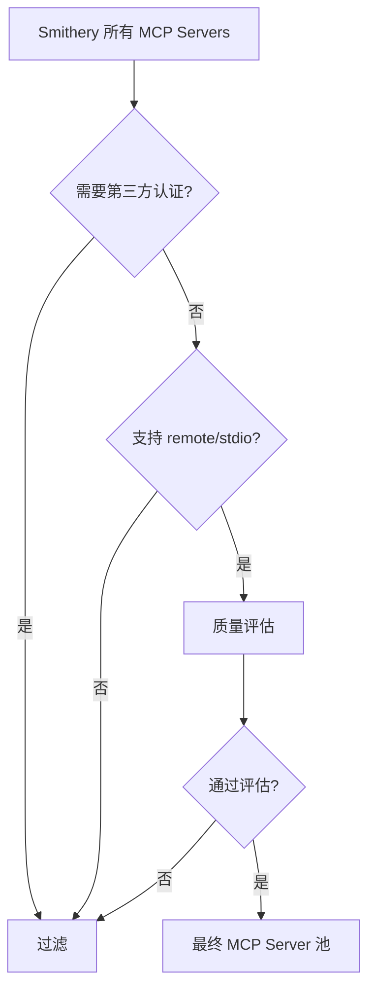

# TOUCAN 论文深度分析报告

## 📄 论文基本信息

- **标题**: TOUCAN: Synthesizing 1.5M Tool-Agentic Data from Real-World MCP Environments
- **文件**: 2510.01179v1.pdf
- **页数**: 35页
- **研究方向**: 基于真实 MCP 环境的大规模工具代理数据合成

---

## 🎯 研究背景与动机

### 核心问题

当前开源工具代理训练数据存在严重不足：
- 数据集规模小，难以支持大规模 SFT
- 缺乏数据集管理透明度
- 工具响应多为 LLM 模拟，缺乏真实性
- 多轮对话数据质量低

### MCP (Model Context Protocol) 的重要性

**MCP** 是一个标准化协议，用于：
- 连接 LLM 与外部工具和数据源
- 提供统一的工具调用接口
- 支持真实的工具执行环境

**Smithery 平台**：
- 托管了近 500 个真实的 MCP servers
- 提供超过 2,000 个真实工具
- 覆盖多个领域和应用场景

---

## 💡 核心创新：TOUCAN 数据集

### 数据集规模

**TOUCAN** = 史上最大的公开工具代理数据集

| 指标 | 数量 |
|------|------|
| **总轨迹数** | 1,527,259 |
| **多轮对话数** | 567,262 |
| **MCP Servers** | ~500 |
| **工具数量** | 2,000+ |

### 与现有数据集对比

| 数据集 | 轨迹数 | 多轮对话 | 工具来源 | 工具响应 |
|--------|--------|---------|---------|---------|
| **APIGen-MT-5K** | 5,000 | 5,000 | τ-Bench | 执行 |
| **ToolACE** | 11,300 | 509 | 合成 | 模拟 |
| **Hermes FC V1** | 11,570 | 1,890 | 合成 | 执行 |
| **Nemotron** | 310,051 | 199,610 | - | - |
| **TOUCAN** | **1,527,259** | **567,262** | **真实MCP** | **执行** |

### 数据集特点

✅ **规模最大**: 150万+ 轨迹
✅ **真实工具**: 来自真实 MCP servers
✅ **真实响应**: 实际执行工具获得响应
✅ **场景全面**: 单步、并行、多步、多轮、边缘情况
✅ **质量保证**: 多层过滤和验证机制

---

## 🔧 TOUCAN 生成 Pipeline

### Pipeline 概览

TOUCAN 采用**系统化的五阶段流程** + **三个扩展机制**：


### 阶段 1: MCP Server Onboarding

**目标**: 从 Smithery 平台筛选高质量 MCP servers

**过滤流程**：
1. 爬取 Smithery 上所有 MCP servers
2. 过滤需要第三方认证的 servers
3. 保留支持 remote 和 stdio 的 servers
4. 进行数据分析和质量评估

**最终结果**：
- M 个 MCP servers
- N 个 tools
- K 个 tags

### 阶段 2: Task Synthesis

**目标**: 生成多样化的工具使用任务

**生成策略**：

#### 2.1 基于 Persona 的多样化

使用 **5 个不同的教师模型** 生成任务：
- 每个模型有不同的"人格"和生成风格
- 确保任务的多样性和覆盖面

#### 2.2 工具标注

- 使用 LLM 为每个工具打 3 个 tags
- 构建工具关系图（基于 tag 重合度）

#### 2.3 Query 生成

- 基于 neighbor 逻辑选择 1-3 个相关工具
- 参考 M 个 MCP server 的 tool list
- 生成能调用 M+N 个工具的 query

**数据结构**：
```json
{
  "query": "用户请求",
  "target_tools": ["tool1", "tool2", ...],
  "mcp_servers": ["server1", "server2", ...]
}
```

### 阶段 3: Task Filtering (LLM-Based Pre-Filtering)

**目标**: 确保任务质量和相关性

**过滤维度**（6个指标）：

#### 1. Tool Difficulty (工具选择难度)
- **评级**: very easy → very hard
- **考虑因素**: 歧义性、领域知识需求、替代方案

#### 2. Tool Uniqueness (工具唯一性)
- **评级**: not unique → highly unique
- **考虑因素**: 工具必要性、顺序依赖、替代工具可行性

#### 3. Question Quality (问题质量)
- **评级**: very poor → excellent
- **考虑因素**: 语言质量、信息架构、可操作性

#### 4. Scenario Realism (场景真实性)
- **评级**: unrealistic → highly realistic
- **考虑因素**: 行业真实性、工作流准确性、用户行为

#### 5. Verifiable (可验证性)
- **评级**: hard to verify → easy to verify
- **考虑因素**: 答案格式、客观标准、真值可用性

#### 6. Stability (稳定性)
- **评级**: highly unstable → highly stable
- **考虑因素**: 时间依赖、地理变化、系统差异

**过滤机制**：
- 使用 LLM 对每个任务进行评分
- 设置阈值过滤低质量任务
- 确保任务的难度、真实性和可验证性

### 阶段 4: Trajectory Generation

**目标**: 生成高质量的代理轨迹

**使用的教师模型**（3个）：
- 模型 A: 擅长工具选择
- 模型 B: 擅长参数填充
- 模型 C: 擅长多轮对话

**生成流程**：

1. **连接真实 MCP servers**
2. **执行工具调用**
3. **获取真实响应**
4. **记录完整轨迹**

**轨迹结构**：
```json
{
  "turns": [
    {
      "user_query": "...",
      "assistant_response": "...",
      "tool_calls": [...],
      "tool_outputs": [...]
    }
  ]
}
```

### 阶段 5: Trajectory Filtering (Rule & LLM-based Post-Filtering)

**目标**: 确保轨迹质量

#### 规则过滤

1. **Tool Match**: 验证调用的工具是否匹配预期
2. **Execution Success**: 确保工具成功执行
3. **Response Validity**: 检查响应格式和内容

#### LLM 评分

**评估维度**（2个主要 + 1个自动）：

##### 1. Completeness (完整性)
- **评级**: very incomplete → fully complete
- **考虑**:
  - 是否完成所有必需步骤
  - 是否提供最终交付物
  - 是否包含必要的确认和路径

##### 2. Conciseness (简洁性)
- **评级**: very redundant → very concise
- **考虑**:
  - 是否避免重复和不必要的步骤
  - 是否使用最少的工具调用
  - 语言是否简洁清晰

##### 3. Tool Call Accuracy (自动评分)
- 通过规则自动计算
- 验证工具调用的正确性

---

## 🎨 三个扩展机制

### Extension 1: Irrelevance (无关场景)

**目标**: 生成模型应拒绝调用的场景

**方法**：
- 生成缺少必要函数的查询
- 生成缺少必要参数的查询
- 模型应识别并拒绝

**示例**：
```
User: "Fetch the invoice for my booking"
Context: 没有 retrieve_invoice 函数
Expected: "I don't have access to the invoice retrieval function"
```

### Extension 2: Multi-Turn (多轮对话)

**目标**: 生成高质量的多轮交互数据

**方法**：
- 基于单轮轨迹扩展为多轮
- 引入用户反馈和澄清
- 模拟真实的 back-and-forth 交互

**特点**：
- Avg turns: 更高的轮次数
- Avg steps per turn: 更复杂的单轮操作
- Avg tool calls: 更多的工具调用

### Extension 3: Persona-based Diversification (基于角色的多样化)

**目标**: 增加任务和轨迹的多样性

**方法**：
- 使用不同的用户角色（developer, analyst, manager...）
- 不同的任务场景（debugging, analysis, reporting...）
- 不同的交互风格（formal, casual, technical...）

---

## 📊 实验结果

### 评估基准

#### 1. BFCL V3 (Berkeley Function Calling Leaderboard)

**TOUCAN 模型表现**：
- ✅ **超越闭源模型**
- ✅ 在单轮和多轮场景都表现优异
- ✅ 函数调用准确率显著提升

#### 2. τ-Bench

**改进方向**：
- 工具选择准确性
- 执行保真度
- 动态用户交互下的多轮推理

#### 3. τ²-Bench

**验证**：
- 复杂多轮场景处理能力
- 工具链执行能力

#### 4. MCP-Universe Benchmark

**最新基准**（231个真实任务，11个真实MCP servers）：
- 🏆 **TOUCAN 模型达到 SOTA**
- 🏆 在同参数级别持续超越领先模型

### 性能提升总结

| Benchmark | 基线模型 | TOUCAN 模型 | 提升 |
|-----------|---------|------------|------|
| BFCL V3 | 闭源模型 | **超越** | ✅ |
| τ-Bench | 同级模型 | **显著提升** | ✅ |
| MCP-Universe | 同级模型 | **SOTA** | 🏆 |

---

## 🔍 技术细节

### MCP Server 过滤流程



### 数据质量保证机制

#### 多层过滤

1. **Pre-filtering** (任务级别)
   - 6 个维度的 LLM 评分
   - 阈值过滤

2. **Post-filtering** (轨迹级别)
   - 规则验证（Tool Match, Execution Success）
   - LLM 评分（Completeness, Conciseness）

#### 真实性保证

- ✅ 连接真实 MCP servers
- ✅ 执行真实工具调用
- ✅ 获取真实工具响应
- ✅ 验证执行结果

---

## 💪 TOUCAN 的优势

### 1. 规模优势

- **150万+ 轨迹**: 远超现有开源数据集
- **56万+ 多轮对话**: 丰富的交互数据
- **2000+ 工具**: 广泛的领域覆盖

### 2. 质量优势

- **真实 MCP 环境**: 非模拟，真实执行
- **多层过滤**: 6维任务过滤 + 3维轨迹过滤
- **教师模型集成**: 3个专业模型协同

### 3. 场景覆盖

- ✅ Single-step (单步)
- ✅ Parallel (并行)
- ✅ Multi-step (多步)
- ✅ Multi-turn (多轮)
- ✅ Irrelevance (边缘情况)

### 4. 可扩展性

- **标准化 MCP 协议**: 易于添加新工具
- **Pipeline 可复用**: 可应用于新的 MCP servers
- **开源友好**: 数据集、模型、代码全部开源

---

## 🎓 对你的研究的启发

### 直接相关性

你的论文草稿中提到的**创新点1**与 TOUCAN 高度相关：

> "我们把toucan复现了，然后针对其在bfcl上miss info情况下的表现不佳的情况，我们合成了一批拒绝策略的数据..."

### 可借鉴的核心思想

#### 1. MCP Server 管理

**TOUCAN 的做法**：
- 从 Smithery 爬取所有 MCP servers
- 系统化的过滤流程
- 详细的数据分析

**你可以借鉴**：
- MCP server 选择标准
- 过滤规则设计
- 工具分类方法

#### 2. 任务质量过滤

**TOUCAN 的 6 维评估**：
- Tool Difficulty
- Tool Uniqueness
- Question Quality
- Scenario Realism
- Verifiable
- Stability

**你可以应用**：
- 在生成 query 后进行质量评估
- 设置阈值过滤低质量任务
- 确保数据集的整体质量

#### 3. 轨迹质量评估

**TOUCAN 的方法**：
- Completeness (完整性)
- Conciseness (简洁性)
- Tool Call Accuracy (准确性)

**你可以参考**：
- 在生成轨迹后进行评估
- 过滤低质量轨迹
- 提高训练数据质量

#### 4. 扩展机制

**TOUCAN 的三个扩展**：
- Irrelevance: 拒绝场景
- Multi-Turn: 多轮对话
- Persona: 角色多样化

**你的对应**：
- ✅ 已有 miss-func 和 miss-params（对应 Irrelevance）
- ✅ 已有多轮对话生成方法
- 💡 可以添加 Persona-based 多样化

### 差异化方向

你的工作可以在以下方面与 TOUCAN 区分：

#### 1. 图方法的深度应用

**TOUCAN**：
- 基于 tag 的简单关系
- 随机采样工具

**你的方法**：
- 详细的工具依赖图
- 基于依赖关系的图游走
- 更复杂的数据增强操作（Insert/Merge/Split）

#### 2. 执行环境模拟

**TOUCAN**：
- 直接连接真实 MCP
- 获取真实响应

**你的方法**：
- 设计了详细的 Python 代码生成
- `call_external_api` 的 mock 机制
- 支持 Computation/Query/Action 三种类型

#### 3. 拒绝策略的细化

**TOUCAN**：
- Irrelevance extension（较简单）

**你的方法**：
- 详细的 miss-func 算法
- 详细的 miss-params 算法
- 数据变换规则明确

#### 4. 后向-前向翻译

**TOUCAN**：
- 直接从 MCP specs 生成 query
- 使用教师模型生成轨迹

**你的方法**：
- FSP → Query → Execution 完整流程
- 详细的 turn 类型检测
- 针对每种类型的 prompt 设计

---

## 📌 关键要点总结

### 核心贡献

1. ✅ 构建了史上最大的开源工具代理数据集（150万+）
2. ✅ 使用真实 MCP 环境和真实工具响应
3. ✅ 系统化的五阶段 pipeline + 三个扩展
4. ✅ 在多个 benchmark 上达到 SOTA

### 技术亮点

- 🔹 **MCP Server Onboarding**: 系统化的筛选流程
- 🔹 **Task Synthesis**: 5个教师模型 + Persona 多样化
- 🔹 **Multi-layer Filtering**: 6维任务过滤 + 3维轨迹过滤
- 🔹 **Real Execution**: 连接真实 MCP，获取真实响应
- 🔹 **Extensions**: Irrelevance + Multi-Turn + Persona

### 数据集特点

- ⭐ 规模: 1,527,259 轨迹
- ⭐ 多轮: 567,262 对话
- ⭐ 工具: 2,000+ 真实工具
- ⭐ 场景: 全面覆盖（单步/并行/多步/多轮/边缘）
- ⭐ 质量: 多层过滤保证

---

## 🔗 与你的研究的结合点

### 论文结构对应

| TOUCAN 部分 | 你的论文对应部分 |
|------------|----------------|
| MCP Server Onboarding | 3.1.1 数据来源 |
| Task Synthesis | 3.1.2 Query生成 |
| Task Filtering | 3.3 数据分析（可新增） |
| Trajectory Generation | 3.1.2 Trajectory Rollout |
| Extensions - Irrelevance | 3.1.3 拒绝策略数据增强 |
| Extensions - Multi-Turn | 3.1.2 多轮对话生成 |

### 可以引用的点

#### Related Work
- 介绍 TOUCAN 作为最大的开源工具代理数据集
- 对比 TOUCAN 的规模和质量

#### Method
- 参考 TOUCAN 的 MCP server 筛选方法
- 借鉴任务和轨迹的质量过滤机制
- 说明你的图方法是对 TOUCAN 的改进

#### Experiments
- 使用 TOUCAN 提到的 benchmarks（BFCL, τ-Bench, MCP-Universe）
- 对比你的数据集与 TOUCAN 的数据质量指标

### 互补性分析

| 方面 | TOUCAN | 你的方法 | 结合优势 |
|------|--------|---------|---------|
| **数据来源** | 真实 MCP | 真实 MCP | ✅ 都使用真实环境 |
| **生成方法** | 随机采样 | 图游走 | 💡 你的方法更结构化 |
| **数据增强** | Extensions | Insert/Merge/Split | 💡 你的操作更细粒度 |
| **质量控制** | 多层过滤 | 图约束 + 过滤 | ✅ 双重保证 |
| **规模** | 150万+ | 待定 | 💡 可以参考 TOUCAN 的规模目标 |

---

## 💡 实施建议

### 1. 借鉴 TOUCAN 的过滤机制

**建议**：
- 在生成 query 后，添加 6 维质量评估
- 在生成轨迹后，添加 Completeness 和 Conciseness 评估
- 设置合理的阈值

**实施**：
```python
def filter_task(task, mcp_servers):
    scores = llm_evaluate_task(
        task,
        dimensions=[
            "tool_difficulty",
            "tool_uniqueness", 
            "question_quality",
            "scenario_realism",
            "verifiable",
            "stability"
        ]
    )
    return all(score >= threshold for score in scores.values())
```

### 2. 扩展拒绝策略数据

**TOUCAN 的 Irrelevance**：
- 缺少函数
- 缺少参数

**你的扩展**：
- ✅ 已有 miss-func（更详细）
- ✅ 已有 miss-params（更详细）
- 💡 可以添加：错误的函数组合、冲突的参数等

### 3. 增加 Persona 多样化

**建议**：
- 定义不同的用户角色（developer, analyst, manager, user）
- 为每个角色设计不同的查询风格
- 生成更多样化的数据

**示例**：
```python
personas = {
    "developer": "技术性强，关注实现细节",
    "analyst": "关注数据分析和洞察",
    "manager": "关注高层次的业务目标",
    "end_user": "非技术性，关注功能和结果"
}
```

### 4. 对比实验设计

**建议的对比维度**：

| 维度 | TOUCAN | 你的方法 |
|------|--------|---------|
| 数据量 | 150万+ | X万 |
| Avg turns | Y | Z |
| Avg steps/turn | A | B |
| Avg tool calls | C | D |
| 依赖关系复杂度 | 低 | 高 |
| 拒绝样本比例 | E% | F% |

---

## 📖 推荐阅读顺序

1. **Introduction + Table 1**: 理解数据集规模和对比
2. **Section 3.1**: 完整的 Pipeline 流程
3. **Figure 2**: 可视化理解整体架构
4. **Section 3.1.3 + 3.1.4**: 过滤机制（重点）
5. **Extensions**: 三个扩展机制
6. **Experiments**: 验证效果
7. **Appendix D**: Prompt 设计细节

---

## 🔄 与 MAGNET 的对比

| 方面 | MAGNET | TOUCAN |
|------|--------|--------|
| **核心方法** | 图 + 节点操作 | MCP + 多层过滤 |
| **数据来源** | StableToolBench | 真实 MCP |
| **规模** | 34K (SFT) | 150万+ |
| **重点** | 多轮对话质量 | 大规模真实数据 |
| **创新** | 图方法 + 蒸馏 | Pipeline + 过滤 |
| **适用场景** | 高质量小数据 | 大规模预训练 |

### 结合两者的优势

**你的研究可以**：
1. 使用 TOUCAN 的 MCP 筛选和过滤机制
2. 应用 MAGNET 的图方法和节点操作
3. 结合两者的优势，生成高质量大规模数据

---

**分析完成时间**: 2026-01-21
