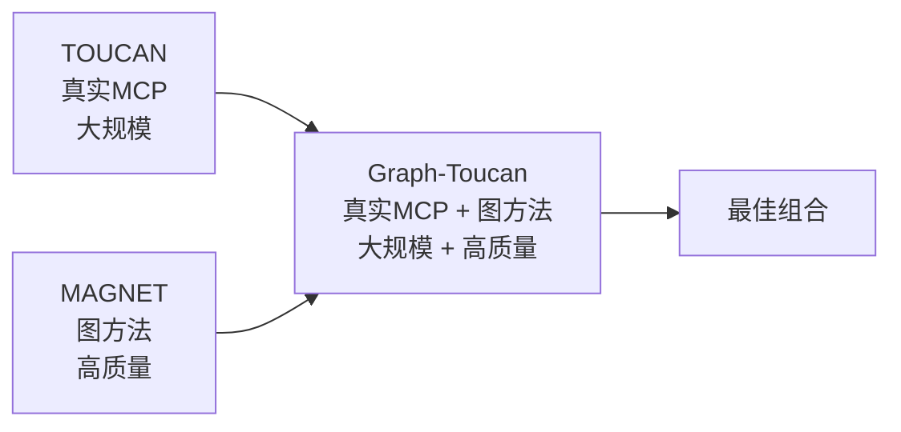
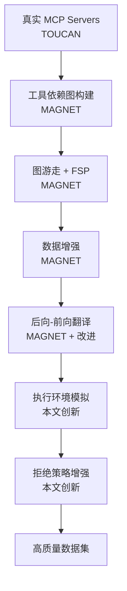
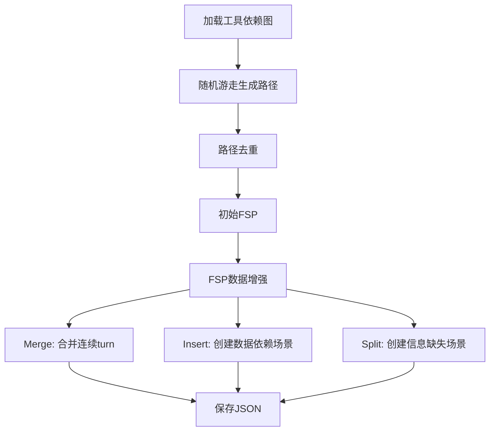

# Graph-Toucan: 基于图翻译的真实 MCP 环境多轮工具调用数据合成

**Graph-Toucan: Synthesizing High-Quality Multi-Turn Tool-Use Data from Real MCP Environments via Graph Translation**

## 论文结构大纲

> **核心定位**: 结合 TOUCAN 的真实 MCP 环境 + MAGNET 的图方法，生成高质量大规模工具调用数据

---

## 1. Introduction (引言)

### 1.1 研究背景
- **大语言模型的发展现状**
  - 大语言模型在各领域的应用突破
  - Agent系统的重要性（如Claude Code、Kimi、GLM等）
  - Agent训练依赖大规模高质量的agentic数据进行增量训练

- **Agentic数据与Tool Use的关系**
  - Agentic数据的核心组成：工具使用（Tool Use）能力
  - 开源模型激发agentic潜能的关键：高质量、大规模的Tool Use数据

### 1.2 Tool Use数据的定义与分类
参考BFCL Benchmark的分类体系：

- **Single-turn数据**
  - **Single-step**: 单轮单步调用，用于warm-up模型的基础function call能力
  - **Multi-step**: 单轮多步调用，展示模型将large task拆分为atomic tasks的planning能力

- **Multi-turn数据**
  - 模拟真实用户与模型的back-and-forth交互流程
  - 包含上下文依赖、信息补充、拒绝策略等复杂场景

### 1.3 当前研究的不足与挑战

#### 1.3.1 现有数据集对比

| 数据集 | 规模 | 工具来源 | 生成方法 | 多轮质量 | 拒绝策略 | 主要局限 |
|--------|------|---------|---------|---------|---------|---------|
| **TOUCAN** | 150万+ | 真实MCP ✅ | 随机采样 | 中等 | 简单 | 多轮数据质量低 |
| **MAGNET** | 34K | 合成函数 | 图游走 ✅ | 高 ✅ | 无 | 非真实环境 |
| **APIGen** | 小规模 | 合成 | LLM生成 | 低 | 无 | 规模和质量都不足 |
| **ToolACE** | 11K | 合成 | LLM模拟 | 低 | 有 | 工具响应模拟 |

#### 1.3.2 TOUCAN 的局限性

**优势**：
- ✅ 使用真实 MCP servers（500个，2000+工具）
- ✅ 真实工具执行和响应
- ✅ 规模大（150万+轨迹）

**不足**：
- ❌ **随机采样策略**：缺乏结构化的工具选择逻辑
- ❌ **多轮数据质量低**：
  - Avg turns 较低
  - 缺少复杂的依赖关系
  - 工具调用链简单
- ❌ **拒绝策略简单**：Irrelevance extension 不够详细
- ❌ **缺少可解释性**：无法解释为什么选择这些工具组合

#### 1.3.3 MAGNET 的局限性

**优势**：
- ✅ 基于图的结构化方法
- ✅ 节点操作（Insert/Merge/Split）覆盖多种场景
- ✅ 高质量的多轮数据
- ✅ 可解释的轨迹生成路径

**不足**：
- ❌ **使用合成函数**：StableToolBench 而非真实 MCP
- ❌ **规模较小**：34K SFT 数据
- ❌ **缺少真实执行**：无法验证工具调用的实际可行性
- ❌ **工具响应模拟**：可能与真实环境有差异

#### 1.3.4 研究空白

**核心问题**：如何结合 TOUCAN 的真实性和 MAGNET 的方法论？

- 🔍 缺少在**真实 MCP 环境**下应用**图方法**的研究
- 🔍 缺少**结构化**且**大规模**的真实工具调用数据
- 🔍 缺少**详细的拒绝策略**数据生成算法
- 🔍 缺少针对**真实 MCP 工具**的执行环境模拟方案
- 🔍 **MAGNET 未开源**：无法复现其图方法，无法应用于真实场景

### 1.4 本文的主要贡献

本文提出 **Graph-Toucan**，一个结合 TOUCAN 真实性和 MAGNET 方法论的工具调用数据合成系统。

#### 贡献 1: 基于 TOUCAN 的改进 - 详细的拒绝策略数据生成

**问题**：TOUCAN 在 BFCL miss-info 场景下表现不佳，Irrelevance extension 过于简单

**我们的解决方案**：
- ✅ 设计了**详细的 miss-func 算法**
  - 从轨迹中定位工具首次出现位置
  - Mask 工具并重写回答
  - 数据变换：`[Q, A] → [Q, A1, Q1, A]`
  
- ✅ 设计了**详细的 miss-params 算法**
  - 重写 query 使其缺少必要参数
  - 生成拒绝回答和补充信息
  - 数据变换：`[Q, A] → [Q1, A1, Q2, A]`

**预期效果**：在保持其他指标不下降的前提下，显著提升 miss-info 指标

#### 贡献 2: 基于 MAGNET 的改进 - 真实 MCP 环境下的图方法

**问题**：
- TOUCAN 使用随机采样，多轮数据质量低
- MAGNET 使用合成函数，缺乏真实性

**我们的解决方案**：将 MAGNET 的图方法应用于 TOUCAN 的真实 MCP 环境

- ✅ **工具依赖图构建**（参考 MAGNET）
  - 基于 LLM Judge 判断依赖类型（Full/Partial/Prerequisite）
  - 应用于真实 MCP 工具（而非合成函数）
  
- ✅ **图游走 + 数据增强**（参考 MAGNET）
  - 随机游走生成 FSP
  - Insert/Merge/Split 操作覆盖多种场景
  
- ✅ **后向-前向翻译**（参考 MAGNET，但有改进）
  - 详细的 Turn 类型检测（7种类型）
  - 针对每种类型的 Prompt 设计
  - 完整的 FSP → Query → Execution pipeline

**优势**：
- 相比 TOUCAN：更高的可解释性和数据质量
- 相比 MAGNET：真实 MCP 环境，更大规模

#### 贡献 3: 独特的执行环境模拟机制

**问题**：真实 MCP 工具缺少 output schema，难以模拟执行

**我们的解决方案**：

- ✅ **工具分类**（Computation/Query/Action）
  - 为不同类型设计不同的模拟策略
  
- ✅ **Python 代码生成**
  - 将工具转换为可执行的 Python 代码
  - Computation 类型：纯计算逻辑
  - Query/Action 类型：`call_external_api` + mock 机制
  
- ✅ **Output Schema 生成**
  - 从实际调用 examples 推断 output schema
  - 支持字段展平和重构

**创新点**：这是首个针对真实 MCP 工具的系统化执行模拟方案

#### 贡献 4: 完全开源的数据集、模型和代码

> **重要**：MAGNET 未开源代码，本文是首个开源实现图方法用于工具调用数据合成的工作

- 📊 **数据规模**：X 万轨迹（目标：与 TOUCAN 相当）
- 🎯 **数据质量**：
  - 更高的 avg turns（通过图方法）
  - 更复杂的依赖关系（通过节点操作）
  - 更详细的拒绝样本（通过改进算法）
  
- 🌐 **完全开源**（填补 MAGNET 的空白）：
  - ✅ **代码开源** → GitHub (graph-toucan)
    - 工具依赖图构建算法实现
    - 图游走和数据增强实现
    - 后向-前向翻译完整 pipeline
    - 执行环境模拟代码
  - ✅ **数据集开源** → Hugging Face
  - ✅ **模型开源** → Hugging Face

**意义**：
- 🔬 **可复现**：研究者可以验证和复现我们的结果
- 🚀 **可扩展**：可以应用于新的 MCP servers 和工具
- 🌍 **社区贡献**：推动开源工具调用数据合成研究

#### 总结：我们的定位

```
Graph-Toucan = TOUCAN 的真实性 + MAGNET 的方法论 + 独特的执行模拟
```

| 维度 | TOUCAN | MAGNET | **Graph-Toucan** |
|------|--------|--------|-----------------|
| 数据来源 | 真实MCP ✅ | 合成函数 | **真实MCP** ✅ |
| 生成方法 | 随机采样 | 图游走 ✅ | **图游走** ✅ |
| 多轮质量 | 中等 | 高 ✅ | **高** ✅ |
| 拒绝策略 | 简单 | 无 | **详细** ✅ |
| 执行模拟 | 真实执行 | 无 | **Python模拟** ✅ |
| 规模 | 150万+ ✅ | 34K | **X万** ✅ |
| **代码开源** | ✅ | ❌ | **✅** ⭐ |

---

## 2. Related Work (相关工作)

### 2.1 Tool Use Benchmarks
- **BFCL (Berkeley Function Calling Leaderboard)**
  - 评估指标体系
  - Miss-info、Miss-func、Miss-params等场景

- **T-Bench**
  - 多轮对话评估
  - 复杂工具调用场景

### 2.2 开源Tool Use数据集

#### 2.2.1 TOUCAN (重点分析)

**核心贡献**：
- 史上最大的开源工具代理数据集（150万+轨迹）
- 使用真实 MCP servers（~500个，2000+工具）
- 真实工具执行和响应

**Pipeline**：
1. MCP Server Onboarding：筛选高质量 MCP servers
2. Task Synthesis：5个教师模型 + Persona 多样化
3. Task Filtering：6维质量评估
4. Trajectory Generation：连接真实 MCP 执行
5. Trajectory Filtering：3维轨迹评估

**Extensions**：
- Irrelevance：生成拒绝场景
- Multi-Turn：扩展为多轮对话
- Persona：角色多样化

**优势**：
- ✅ 真实 MCP 环境
- ✅ 大规模数据
- ✅ 多层质量过滤

**局限性**（本文改进点）：
- ❌ 随机采样工具，缺乏结构化逻辑
- ❌ 多轮数据质量中等（avg turns 低，依赖关系简单）
- ❌ Irrelevance extension 过于简单
- ❌ 缺少可解释的工具选择路径

#### 2.2.2 其他数据集

- **APIGen**
  - 21个域的数据
  - LLM 生成，规模较小
  - 缺少真实工具执行

- **ToolACE**
  - 11K 轨迹
  - 工具响应为 LLM 模拟
  - 有边缘情况但规模小

- **Action98k**
  - 98K 动作数据
  - 聚焦特定领域

### 2.3 数据合成方法

#### 2.3.1 MAGNET (重点分析)

**核心贡献**：
- 基于图的多轮函数调用数据合成
- 节点操作（Insert/Merge/Split）
- 上下文蒸馏（Context Distillation）

**方法**：
1. **工具依赖图构建**
   - 函数作为节点
   - 基于输入输出关系建立有向边
   - 依赖类型：Full/Partial/Prerequisite

2. **图游走 + FSP 生成**
   - 随机游走采样函数序列
   - 形成 Function Signature Path (FSP)

3. **节点操作**
   - Insert：创建依赖关系（short/long dependency）
   - Merge：合并连续 turn
   - Split：创建信息缺失场景

4. **前后向翻译**
   - Back-translation: FSP → Query
   - Forth-translation: Query → Function Calls

5. **上下文蒸馏**
   - 使用 Gemini-1.5-pro-002 作为教师
   - 正负样本对比学习

**实验结果**：
- BFCL-v3 排名第 4
- 多轮场景提升 32.5 分
- 超越教师模型

**优势**：
- ✅ 结构化的图方法
- ✅ 高质量多轮数据
- ✅ 可解释的生成路径
- ✅ 覆盖多种复杂场景

**局限性**（本文改进点）：
- ❌ 使用 StableToolBench（合成函数）
- ❌ 规模较小（34K SFT）
- ❌ 缺少真实执行
- ❌ 工具响应模拟
- ❌ **代码未开源**：无法复现和应用于真实环境未针对真实 MCP 环境设计
- ❌ **代码未开源**：研究者无法复现和扩展其方法

#### 2.3.2 本文与 TOUCAN、MAGNET 的关系

**我们的定位**：



**对比表格**：

| 维度 | TOUCAN | MAGNET | **Graph-Toucan** |
|------|--------|--------|-----------------|
| **数据来源** | 真实MCP ✅ | 合成函数 | **真实MCP** ✅ |
| **生成方法** | 随机采样 | 图游走 ✅ | **图游走** ✅ |
| **数据增强** | Extensions | Insert/Merge/Split ✅ | **Insert/Merge/Split** ✅ |
| **拒绝策略** | 简单 Irrelevance | 无 | **详细算法** ✅ |
| **执行模拟** | 真实执行 | 无 | **Python 模拟** ✅ |
| **规模** | 150万+ ✅ | 34K | **X万** ✅ |
| **多轮质量** | 中等 | 高 ✅ | **高** ✅ |
| **代码开源** | ✅ | ❌ | **✅** ⭐ |

#### 2.3.3 其他相关工作

- **Environment Scaling** (T-Bench)
  - 环境复杂度递增
  - 评估多轮推理能力

- **LLM-based 数据合成**
  - Self-Instruct
  - Evol-Instruct
  - 应用于工具调用领域

---

## 3. Method (方法)

### 3.1 Graph-Toucan 系统概览

**核心思想**：结合 TOUCAN 的真实 MCP 环境和 MAGNET 的图方法



**两大创新方向**：
1. **基于 TOUCAN 的改进**（Section 3.2）
   - 复现 TOUCAN 的基础 pipeline
   - 设计详细的拒绝策略数据生成算法
   
2. **基于 MAGNET 的改进**（Section 3.3）
   - 将图方法应用于真实 MCP 环境
   - 设计执行环境模拟机制

#### 3.1.1 数据来源：真实 MCP Servers（参考 TOUCAN）

**MCP Server Onboarding**（完全参考 TOUCAN）：

1. **爬取 Smithery 平台**
   - 获取所有公开的 MCP servers
   - 提取工具规范和元数据

2. **过滤策略**
   - 去除需要第三方认证的 servers
   - 保留支持 remote 和 stdio 的 servers
   - 进行稳定性测试

3. **最终数据**
   - M 个 MCP servers
   - N 个 tools
   - K 个 tags（从 Smithery 获取）

**与 TOUCAN 的区别**：
- ✅ 我们使用相同的 MCP 筛选流程
- ✅ 但后续使用图方法而非随机采样

### 3.2 基于 TOUCAN 的改进：详细的拒绝策略数据生成

> **目标**：解决 TOUCAN 在 BFCL miss-info 场景下表现不佳的问题

#### 3.2.1 TOUCAN 基础 Pipeline 复现

**Step 1: 工具标注与关系构建**（参考 TOUCAN）
- 对N个tools使用LLM进行tag标注（每个tool 3个tags）
- 数据结构：`tools_list: [{toolA: [{function_schema, tags}]}]`

**Step 2: Query生成**
- 基于neighbor逻辑选择N个tools（1-3个，至少有一个tag重合）
- 参考M个MCP server的tool list
- 生成目标：能调用M+N个tools的query
- 输出：A个QA对 `[query, target_tool_list]`（single-turn数据）

**Step 3: Trajectory Rollout**
- 使用LangGraph构建rollout流程
- 执行A条数据，得到A个trajectory
- 借鉴Toucan方法生成B条multi-turn trajectory

**Step 4: 数据缺陷分析**
- 分析指标：avg turns、avg steps per turn、avg tool calls
- 指出缺点：**缺少拒绝样本**

#### 3.2.2 拒绝策略数据增强（本文创新）

**与 TOUCAN 的对比**：

| 维度 | TOUCAN Irrelevance | **Graph-Toucan 拒绝策略** |
|------|-------------------|------------------------|
| **Miss-func** | 简单生成缺少函数的场景 | **详细算法**：定位、mask、重写 |
| **Miss-params** | 简单生成缺少参数的场景 | **详细算法**：重写query、拒绝、补充 |
| **数据变换** | 未明确说明 | **明确规则**：`[Q,A]→[Q,A1,Q1,A]` |
| **可复现性** | 低 | **高**（详细算法步骤） |

##### Miss-func 类型数据生成（本文创新）
- 算法流程：
  1. 找到轨迹中每个tool第一次出现的位置
  2. 随机抽样一个tool及其对应的turn index
  3. 将该tool从tool schema中mask掉
  4. 修改该turn的回答，输出拒绝原因
  5. 插入新的QA对，提供缺失的函数schema
- 数据变换：`[Q, A]` → `[Q, A1, Q1, A]`

**Miss-params类型数据生成**
- 算法流程：
  1. 对multi-turn数据进行标注，抽样需要增强的数据
  2. 重写query（Q1），使其缺少调用目标函数的必要信息
  3. 重写answer（A1），解释为什么不能调用
  4. 添加Q2，补充缺失的参数信息
  5. 正常继续调用
- 数据变换：`[Q, A]` → `[Q1, A1, Q2, A]`

### 3.3 基于 MAGNET 的改进：真实 MCP 环境下的图方法

> **目标**：将 MAGNET 的图方法应用于 TOUCAN 的真实 MCP 环境，提升多轮数据质量

#### 3.3.1 动机与挑战

**TOUCAN 的问题**：
- 随机采样工具，缺乏结构化逻辑
- 多轮数据质量中等（avg turns 低，依赖关系简单）
- 缺少可解释的工具选择路径

**MAGNET 的优势**：
- 基于图的结构化方法
- 节点操作覆盖多种场景
- 高质量的多轮数据

**我们的挑战**：
- 如何将 MAGNET 的图方法应用于真实 MCP 工具？
- 如何处理真实工具缺少 output schema 的问题？
- 如何模拟真实工具的执行环境？

**我们的解决方案**：
1. 从实际调用 examples 推断 output schema
2. 设计工具分类和执行模拟机制
3. 完整的 FSP → Query → Execution pipeline

#### 3.3.2 数据预处理（本文创新 - 解决真实 MCP 的特殊问题）

**与 MAGNET 的区别**：
- MAGNET 使用 StableToolBench，函数有完整的 input/output schema
- 真实 MCP 工具通常只有 input params，**缺少 output schema**
- 我们需要额外的预处理步骤

**Step 1: Tool Output Schema 生成**（本文创新）

- **问题**：MCP 中的真实 tools 只有 input params，缺少 output schema
- 解决方案：
  - 从data1（方法1合成的数据）中为每个tool选择3-4个实际调用example
  - 使用LLM基于examples设计tool output schema
  - 忽略从input schema传递而来的output字段

**Step 2: Tool分类**
- 使用LLM对tools进行分类：
  1. **Computation**: 不依赖外部信息源，仅执行内部运算（如计算器、单位转换、JSON解析）
  2. **Query**: 依赖外部信息源检索数据，不修改外部状态（如搜索数据库、天气查询、文件读取）
  3. **Action**: 依赖外部信息源，且会修改外部状态（如创建文件、执行脚本）

**Step 3: 最终Tool集合**
- 取`tools_output_schema`和`tool_classification_result`的交集
- 得到用于建图的所有tool节点

#### 3.3.3 工具依赖图构建算法（参考 MAGNET）

**说明**：此部分完全参考 MAGNET 的方法，但应用于真实 MCP 工具

**Step 1: 输出参数过滤**（MAGNET 方法）
- 过滤规则：
  1. 输出参数名称 == 输入参数名称 → 直接过滤
  2. 输出参数描述与输入参数描述语义完全相同（LLM判断）→ 过滤
- 原因：避免无意义的依赖关系（如`funcA(userId) → (userId)`, `funcB(userId)`）

**Step 2: 边判断（基于LLM Judge）**
- 分析是否应该建立有向边 `node → candidate`
- 依赖类型判断：

| 依赖类型 | 描述 | 示例 |
|---------|------|------|
| **Full** | node输出可作为candidate的完整输入 | `get_user_info → (id, name)`<br>`send_email(id, name, msg)` |
| **Partial** | node输出可作为candidate的部分输入 | `get_file_path → (path)`<br>`read_file(path, encoding)` |
| **Prerequisite** | node输出决定是否应该调用candidate | `check_file_exists → (exists)`<br>`download_file(url)` |
| **None** | 无依赖关系 | - |

#### 3.3.4 基于图游走的路径生成（参考 MAGNET）

**说明**：此部分参考 MAGNET 的图游走和数据增强方法

**Step 1: 随机游走生成DAG**（MAGNET 方法）
- 以每个节点为起点
- 设置`max_steps`（最大游走次数）
- 采样出有向无环图（DAG）

**Step 2: 路径去重**
- 对单节点进行多次路径游走
- 对路径进行去重

**Step 3: 初始FSP生成**
- 遍历全图，得到初始的Function Sequence Path (FSP)
- 结构：每个turn一个节点（单轮对话单函数调用意图）

**Step 4: 数据增强操作**
目标：合成具有依赖关系且多函数意图的数据

1. **Merge操作**：合并连续turn
   - 输入：`turn0: [get_distance]`, `turn1: [set_navigation]`
   - 输出：`turn0: [get_distance, set_navigation]`
   - 目的：模拟单轮对话包含多个函数调用的场景

2. **Insert操作**：创建有依赖关系的函数调用场景
   - **Short dependency**: 同一turn中`[funcA, funcB]`存在数据依赖
   - **Long dependency**: 跨turn之间存在数据依赖`[funcA]` ... `[funcB]`

3. **Split操作**：创建信息缺失场景
   - 生成`turn1: []`
   - 模型应表示拒绝调用的意图

**整体流程图**：


#### 3.3.5 模拟数据执行环境（本文独特创新）

**动机**：
- MAGNET 使用合成函数，可以直接执行
- 真实 MCP 工具无法在数据生成阶段大规模调用（成本高、不稳定）
- 需要设计执行环境模拟机制

**创新点**：首个针对真实 MCP 工具的系统化执行模拟方案

**Step 1: Tool 转 Python 代码**（本文创新）

- **Computation类型**：
  - 实现纯计算逻辑
  - 不允许API调用和网络请求

- **Query和Action类型**：
  - 创建helper函数：`call_external_api(tool_name: str) → Dict[str, Any]`
  - 返回来自外部信息源的数据
  - 仅返回flat后的simple字段（str, int, bool, float）
  - 不允许返回nested结构

**Step 2: 字段展平（Flattening）**
- Nested object: `user.name` → `user_name`
- List/Array: `items[].name` → `item_0_name`, `item_1_name`
- 对于list字段，生成2个items

**Step 3: 主函数实现**
- 调用`call_external_api`获取外部数据
- 将flat字段reconstruct为nested structure
- 包含错误处理和输入参数校验

#### 3.3.6 后向-前向翻译算法（参考 MAGNET，但有改进）

**与 MAGNET 的对比**：

| 维度 | MAGNET | **Graph-Toucan** |
|------|--------|-----------------|
| **Turn 类型** | 未明确分类 | **7种详细类型** |
| **Prompt 设计** | 基础 prompt | **针对每种类型的详细 prompt** |
| **执行模拟** | 无 | **Python 代码 + mock API** |

**Step 1: Turn 类型检测**（本文改进）

| Turn类型 | 描述 | Query生成策略 |
|---------|------|--------------|
| **Normal** | 没有进行任何变换操作 | 根据turn的函数生成满足调用函数的请求 |
| **Empty** | 进行了split操作 | 生成无法满足本轮函数调用条件的请求 |
| **Merge** | 进行了merge操作 | 生成多意图请求 |
| **Insert Short Dependency** | turn内insert了函数 | 只提最终目标（helper函数隐式） |
| **Insert Long Dependency** | 跨turn引用了历史 | 使用代词引用（如"that distance"） |
| **Insert Mixed** | 同时用long/short dependency | 混合策略 |
| **Merge with Insert** | 混合 | 多意图并行 + 代词引用 |

**Step 2: 为每种Turn类型构建Prompt**

示例Prompt结构：

- **Empty Turn Prompt**:
```
You are role-playing as a user in a multi-turn conversation with a function-calling agent. This is Turn {turn_idx}.

The user will make a request, but there is NO suitable function available to fulfill it, or the request is missing critical parameters.

{error_feedback_prompt}
{history_block}
{last_round_block}

Your task:
Generate a natural user query that would require a function that doesn't exist, or that is missing critical information.
```

- **Merged Turn Prompt**:
```
This is a MERGED scenario where you express multiple intents in a single query.

MERGED Definition:
- Multiple functions in the SAME turn with potential SHORT DEPENDENCY
- Output of one function may feed as input to the next (within same turn)
- User EXPLICITLY mentions ALL actions/intents

Use connecting words to link multiple intents: "and", "then"...

** All functions to call**: {turn_functions}

{error_feedback_prompt}
{history_block}
{last_round_block}

CRITICAL Instructions:
1. Explicitly mention all {len(turn_functions)} intents/actions in your query
2. Use connecting words: and, then, after that
3. Make the data flow clear if function has dependency
4. Each function should be reflected in the query
5. Natural combination of multiple explicit intents

Contrast with insert short:
- Insert short: "Navigate to San Mateo" (only final goal, distance is implicit)
- Merged: "Find the distance to San Mateo and set up navigation" (both are explicit)

{style_instruction}
{examples_block}

Candidate Functions:
{candidate_block}
```

- **Merge with Insert Prompt**:
```
This is a Merge + Insert scenario with multiple types of functions.

Function Classification:
- MERGED functions (explicit intents): {merged_funcs_str}
- LONG-DEPENDENCY functions (explicit, reference history): {long_dep_funcs_str}
- SHORT-DEPENDENCY helpers (implicit, do NOT mention)

**ALL functions to call**

Dependency Info:
Short dependency:
  {source_func} → {target_func}
  {source_func} output: ...
  {target_func} input schema: see params in Candidate functions below

Long dependency:
  Turn {source_turn}: {source_func} → Turn {target_turn}: {target_func}
  {source_func} output: ...
  {target_func} input: ...

{history_block}
{last_round_block}

CRITICAL INSTRUCTIONS:
- MERGED functions: Express these explicit intents clearly
- Long-dependency functions:
  * Express these intents BUT use pronouns to reference previous outputs
  * DO NOT repeat specific values from history
  * Understand the cross-turn data flow
```

**Step 3: Query生成**
- 调用LLM，基于构建的prompt生成query

**Step 4: 前向执行（Forward Execution）**

单个Turn的执行流程：
```python
for func in execution_order:
    # 1. 生成参数
    param_result = generate_single_func_params(
        turn_query, function_name, context, tool_schemas
    )
    # LLM输出每个参数值的来源：context or query
    # 如果不能找到，拒绝填参数
    
    # 2. 执行函数
    exec_result = execute_function_call(
        function_name, param_result, tool_schema
    )
    # 执行逻辑：
    # - 判断是否依赖外部信息（是否有call_external_api）
    # - 如果有，先执行simulate_call_external_api
    # - 动态替换placeholder为mock_api
    # - 运行函数后再替换回来
    
    turn_output.append(exec_result)
```

多个Turn的执行流程：
```python
for single_turn in turns:
    detect_turn_type()
    construct_turn_prompt_for_each_turn()
    generate_each_turn_query()
    forward_to_turn_params()  # 包含single turn的循环
```

### 3.4 数据质量分析与对比

#### 3.4.1 数据集统计

对生成的 Graph-Toucan 数据集进行全面统计分析：

**规模指标**：
- Total trajectories
- Single-turn vs Multi-turn 比例
- 拒绝策略数据比例

**质量指标**：
- Avg turns per conversation
- Avg steps per turn
- Avg tool calls per turn
- 依赖关系分布（Full/Partial/Prerequisite）
- Turn 类型分布（Normal/Empty/Merge/Insert/...）

#### 3.4.2 与 TOUCAN 和 MAGNET 的对比

**对比表格**：

| 指标 | TOUCAN | MAGNET | **Graph-Toucan** | 改进 |
|------|--------|--------|-----------------|------|
| **Avg turns** | X | Y | **Z** | ↑ |
| **Avg steps/turn** | A | B | **C** | ↑ |
| **Avg tool calls** | D | E | **F** | ↑ |
| **依赖关系复杂度** | 低 | 高 | **高** | ✅ |
| **拒绝样本比例** | 低 | 0% | **高** | ✅ |
| **工具来源** | 真实MCP | 合成 | **真实MCP** | ✅ |

**分析重点**：
1. 相比 TOUCAN：更高的多轮质量指标
2. 相比 MAGNET：保持高质量的同时使用真实 MCP
3. 独特优势：详细的拒绝策略数据

---

## 4. Experiments (实验)

### 4.1 实验设置

#### 4.1.1 数据集统计
- **数据规模**
  - Single-turn数据量（single-step vs multi-step）
  - Multi-turn数据量
  - 拒绝策略数据量（miss-func vs miss-params）
  - 图合成数据量

- **数据质量指标**
  - Avg tool calls per turn
  - Avg steps per turn
  - Avg turns per conversation
  - 依赖关系分布（full/partial/prerequisite）

#### 4.1.2 训练框架
- 使用的训练框架（如TRL）
- 模型选择
- 训练超参数

#### 4.1.3 对比基线

**主要对比**：
1. **TOUCAN**
   - 使用其公开的数据集和模型
   - 重点对比：多轮数据质量、miss-info 性能

2. **MAGNET**
   - 复现其方法（使用合成函数）
   - 重点对比：图方法的有效性

3. **Graph-Toucan (Ours)**
   - 结合两者优势
   - 真实 MCP + 图方法

**其他基线**：
- APIGen
- ToolACE
- Action98k

**消融实验组**：

| 实验组 | 数据来源 | 生成方法 | 拒绝策略 | 说明 |
|--------|---------|---------|---------|------|
| **Baseline 1** | 真实MCP | 随机采样 | 简单 | 复现 TOUCAN |
| **Baseline 2** | 合成函数 | 图游走 | 无 | 复现 MAGNET |
| **Ablation 1** | 真实MCP | 图游走 | 无 | 验证图方法在真实MCP的效果 |
| **Ablation 2** | 真实MCP | 随机采样 | 详细 | 验证拒绝策略的效果 |
| **Graph-Toucan** | 真实MCP | 图游走 | 详细 | 完整方法 |

### 4.2 评估Benchmarks

#### 4.2.1 BFCL (Berkeley Function Calling Leaderboard)
- **整体性能**
  - 各类场景的准确率对比

- **Miss-info场景重点分析**
  - Miss-func性能提升
  - Miss-params性能提升
  - 与Toucan的对比

- **其他指标保持情况**
  - Simple场景
  - Multiple场景
  - Parallel场景

#### 4.2.2 τ-Bench
- 多轮对话性能评估
- 复杂工具调用场景表现
- 动态用户交互

#### 4.2.3 τ²-Bench
- 更复杂的多轮场景
- 工具链执行能力

#### 4.2.4 MCP-Universe Benchmark
- **最新基准**（231个真实任务，11个真实MCP servers）
- 执行基础的评估
- 真实世界应用场景
- **重点**：验证在真实 MCP 环境下的性能

#### 4.2.5 其他 Benchmark
- ToolQuery
- StableToolBench（如果适用）

### 4.3 消融实验 (Ablation Study)

#### 4.3.1 拒绝策略数据的影响
- 不加拒绝策略数据 vs 加拒绝策略数据
- Miss-func数据的单独影响
- Miss-params数据的单独影响

#### 4.3.2 图合成数据的影响
- 仅使用Toucan数据 vs 加入图合成数据
- 不同数据增强操作的影响（merge/insert/split）

#### 4.3.3 工具依赖图构建方法的影响
- 不同边判断策略的影响
- 输出参数过滤的影响

### 4.4 数据质量分析

#### 4.4.1 人工评估
- 随机抽样数据进行人工评估
- 评估维度：
  - Query自然度
  - 函数调用合理性
  - 依赖关系正确性
  - 拒绝策略合理性

#### 4.4.2 自动化指标
- 数据多样性分析
- 复杂度分布
- 依赖关系覆盖率

### 4.5 实验结果与分析

#### 4.5.1 主要结果
- 在BFCL上的性能提升
- 在T-Bench上的性能提升
- 与基线模型的对比

#### 4.5.2 案例分析
- 成功案例展示
- 失败案例分析
- 改进方向

---

## 5. Conclusion and Future Work (结论与未来工作)

### 5.1 工作总结
- 本文的主要贡献回顾
- 实验结果总结
- 方法的优势与局限性

### 5.2 未来工作方向

#### 5.2.1 数据集扩展
- 增加更多MCP servers
- 支持更多语言的query生成
- 增加更复杂的依赖关系类型

#### 5.2.2 方法改进
- 更精细的工具依赖图构建
- 更智能的数据增强策略
- 更真实的执行环境模拟

#### 5.2.3 应用拓展
- 支持更多下游任务
- 与其他agent能力的结合（如推理、规划）
- 实际应用场景的验证

---

## 附录 (Appendix)

### A. Prompt Templates
- 工具依赖图构建的详细prompt
- Query生成的详细prompt（各种turn类型）
- 参数生成的详细prompt
- 执行模拟的详细prompt

### B. 数据集详细统计
- MCP servers列表与统计
- Tool分类详细结果
- 工具依赖图可视化

### C. 实验详细结果
- 完整的benchmark结果表格
- 消融实验详细数据
- 人工评估详细结果

### D. 案例展示
- 各种turn类型的生成样例
- 拒绝策略数据样例
- 复杂依赖关系样例

---

## 参考文献 (References)

### 核心参考文献
1. Toucan论文及GitHub repo
2. Magnet论文
3. BFCL benchmark论文及blog
4. T-Bench论文
5. APIGen论文
6. ToolACE论文
7. Action98k论文
8. Kimi技术报告
9. GLM技术报告
10. Claude技术报告

### 相关工作
- MCP (Model Context Protocol)相关文献
- LLM-based数据合成方法
- Agent训练方法
- Function calling相关研究
