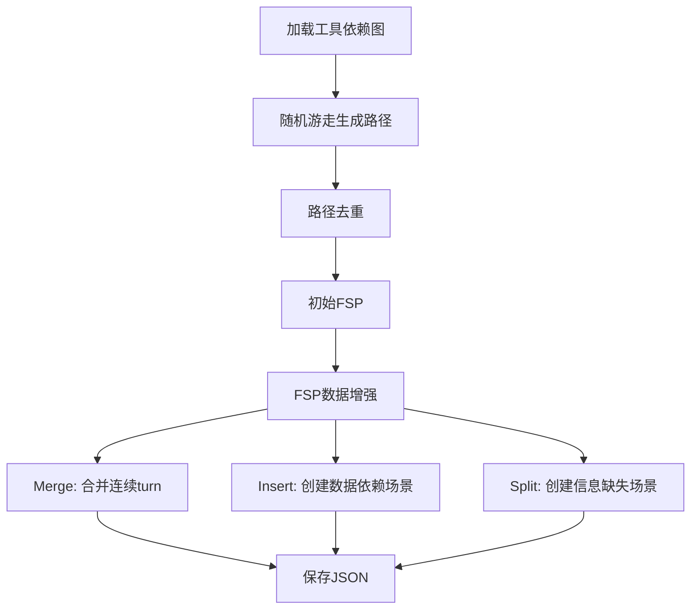

# 基于工具依赖图的高质量多轮对话工具调用数据集生成系统

## 论文结构大纲

---

## 1. Introduction (引言)

### 1.1 研究背景
- **大语言模型的发展现状**
  - 大语言模型在各领域的应用突破
  - Agent系统的重要性（如Claude Code、Kimi、GLM等）
  - Agent训练依赖大规模高质量的agentic数据进行增量训练

- **Agentic数据与Tool Use的关系**
  - Agentic数据的核心组成：工具使用（Tool Use）能力
  - 开源模型激发agentic潜能的关键：高质量、大规模的Tool Use数据

### 1.2 Tool Use数据的定义与分类
参考BFCL Benchmark的分类体系：

- **Single-turn数据**
  - **Single-step**: 单轮单步调用，用于warm-up模型的基础function call能力
  - **Multi-step**: 单轮多步调用，展示模型将large task拆分为atomic tasks的planning能力

- **Multi-turn数据**
  - 模拟真实用户与模型的back-and-forth交互流程
  - 包含上下文依赖、信息补充、拒绝策略等复杂场景

### 1.3 当前研究的不足
- **缺乏scalable、open-source、high-quality的数据集**
  - 现有开源数据集对比分析（Toucan、APIGen、ToolACE、Action98k）
  - 数据质量指标对比表格：
    - Single-turn数据量
    - Multi-turn数据量
    - Avg tool calls per turn
    - Avg steps per turn
    - Multi-turn数据的avg turns

### 1.4 本文的主要贡献
1. **针对Toucan在BFCL miss-info场景下的不足，合成拒绝策略数据**
   - 在保持其他指标不下降的前提下，显著提升miss-info指标

2. **提出基于工具依赖图的数据合成系统**
   - 相比Toucan和APIGen，具有更高的可解释性
   - 基于图游走方法，每条轨迹生成依赖可解释的节点游走路径
   - 生成更高复杂度的数据，支持并行调用、长短依赖、信息缺失等真实场景

3. **构建大规模高质量开源数据集**
   - 数据来源：Smithery真实MCP + 图合成数据
   - 开源数据集、模型至Hugging Face
   - 开源代码至GitHub

---

## 2. Related Work (相关工作)

### 2.1 Tool Use Benchmarks
- **BFCL (Berkeley Function Calling Leaderboard)**
  - 评估指标体系
  - Miss-info、Miss-func、Miss-params等场景

- **T-Bench**
  - 多轮对话评估
  - 复杂工具调用场景

### 2.2 开源Tool Use数据集
- **Toucan**
  - 基于真实MCP的数据合成
  - 优点：真实性高
  - 缺点：成本高、依赖随机采样、多轮数据质量低

- **APIGen**
  - 数据合成方法
  - 优缺点分析

- **ToolACE**
  - 数据特点与局限性

- **Action98k**
  - 数据规模与质量分析

### 2.3 数据合成方法
- **Magnet**
  - 基于图的工具使用数据合成
  - Environment scaling方法

- **其他相关工作**
  - LLM-based数据合成
  - 轨迹采样方法

---

## 3. Method (方法)

### 3.1 数据生成Pipeline总览

#### 3.1.1 数据来源
- **Scenario 1: 真实MCP数据（基于Toucan）**
  - Smithery平台MCP爬取与分析
  - MCP过滤策略（去除需要第三方认证的MCP，保留remote和stdio类型）
  - 最终数据：M个MCP servers，N个tools，K个tags

- **Scenario 2: 基于图的合成数据**
  - 工具依赖图构建
  - 图游走算法
  - 数据增强操作

#### 3.1.2 Toucan复现与改进

**Step 1: 工具标注与关系构建**
- 对N个tools使用LLM进行tag标注（每个tool 3个tags）
- 数据结构：`tools_list: [{toolA: [{function_schema, tags}]}]`

**Step 2: Query生成**
- 基于neighbor逻辑选择N个tools（1-3个，至少有一个tag重合）
- 参考M个MCP server的tool list
- 生成目标：能调用M+N个tools的query
- 输出：A个QA对 `[query, target_tool_list]`（single-turn数据）

**Step 3: Trajectory Rollout**
- 使用LangGraph构建rollout流程
- 执行A条数据，得到A个trajectory
- 借鉴Toucan方法生成B条multi-turn trajectory

**Step 4: 数据缺陷分析**
- 分析指标：avg turns、avg steps per turn、avg tool calls
- 指出缺点：**缺少拒绝样本**

#### 3.1.3 拒绝策略数据增强

**Miss-func类型数据生成**
- 算法流程：
  1. 找到轨迹中每个tool第一次出现的位置
  2. 随机抽样一个tool及其对应的turn index
  3. 将该tool从tool schema中mask掉
  4. 修改该turn的回答，输出拒绝原因
  5. 插入新的QA对，提供缺失的函数schema
- 数据变换：`[Q, A]` → `[Q, A1, Q1, A]`

**Miss-params类型数据生成**
- 算法流程：
  1. 对multi-turn数据进行标注，抽样需要增强的数据
  2. 重写query（Q1），使其缺少调用目标函数的必要信息
  3. 重写answer（A1），解释为什么不能调用
  4. 添加Q2，补充缺失的参数信息
  5. 正常继续调用
- 数据变换：`[Q, A]` → `[Q1, A1, Q2, A]`

### 3.2 基于工具依赖图的数据合成系统

#### 3.2.1 动机
- Toucan的multi-turn数据质量仍有不足
- 参考Magnet、Environment Scaling、T-Bench
- 保留以tool为最小atomic单位，沿用已构建的tool relationship

#### 3.2.2 数据预处理

**Step 1: Tool Output Schema生成**
- 问题：MCP中的真实tools只有input params，缺少output schema
- 解决方案：
  - 从data1（方法1合成的数据）中为每个tool选择3-4个实际调用example
  - 使用LLM基于examples设计tool output schema
  - 忽略从input schema传递而来的output字段

**Step 2: Tool分类**
- 使用LLM对tools进行分类：
  1. **Computation**: 不依赖外部信息源，仅执行内部运算（如计算器、单位转换、JSON解析）
  2. **Query**: 依赖外部信息源检索数据，不修改外部状态（如搜索数据库、天气查询、文件读取）
  3. **Action**: 依赖外部信息源，且会修改外部状态（如创建文件、执行脚本）

**Step 3: 最终Tool集合**
- 取`tools_output_schema`和`tool_classification_result`的交集
- 得到用于建图的所有tool节点

#### 3.2.3 工具依赖图构建算法

**Step 1: 输出参数过滤**
- 过滤规则：
  1. 输出参数名称 == 输入参数名称 → 直接过滤
  2. 输出参数描述与输入参数描述语义完全相同（LLM判断）→ 过滤
- 原因：避免无意义的依赖关系（如`funcA(userId) → (userId)`, `funcB(userId)`）

**Step 2: 边判断（基于LLM Judge）**
- 分析是否应该建立有向边 `node → candidate`
- 依赖类型判断：

| 依赖类型 | 描述 | 示例 |
|---------|------|------|
| **Full** | node输出可作为candidate的完整输入 | `get_user_info → (id, name)`<br>`send_email(id, name, msg)` |
| **Partial** | node输出可作为candidate的部分输入 | `get_file_path → (path)`<br>`read_file(path, encoding)` |
| **Prerequisite** | node输出决定是否应该调用candidate | `check_file_exists → (exists)`<br>`download_file(url)` |
| **None** | 无依赖关系 | - |

#### 3.2.4 基于图游走的路径生成

**Step 1: 随机游走生成DAG**
- 以每个节点为起点
- 设置`max_steps`（最大游走次数）
- 采样出有向无环图（DAG）

**Step 2: 路径去重**
- 对单节点进行多次路径游走
- 对路径进行去重

**Step 3: 初始FSP生成**
- 遍历全图，得到初始的Function Sequence Path (FSP)
- 结构：每个turn一个节点（单轮对话单函数调用意图）

**Step 4: 数据增强操作**
目标：合成具有依赖关系且多函数意图的数据

1. **Merge操作**：合并连续turn
   - 输入：`turn0: [get_distance]`, `turn1: [set_navigation]`
   - 输出：`turn0: [get_distance, set_navigation]`
   - 目的：模拟单轮对话包含多个函数调用的场景

2. **Insert操作**：创建有依赖关系的函数调用场景
   - **Short dependency**: 同一turn中`[funcA, funcB]`存在数据依赖
   - **Long dependency**: 跨turn之间存在数据依赖`[funcA]` ... `[funcB]`

3. **Split操作**：创建信息缺失场景
   - 生成`turn1: []`
   - 模型应表示拒绝调用的意图

**整体流程图**：


#### 3.2.5 模拟数据执行环境

**Step 1: Tool转Python代码**

- **Computation类型**：
  - 实现纯计算逻辑
  - 不允许API调用和网络请求

- **Query和Action类型**：
  - 创建helper函数：`call_external_api(tool_name: str) → Dict[str, Any]`
  - 返回来自外部信息源的数据
  - 仅返回flat后的simple字段（str, int, bool, float）
  - 不允许返回nested结构

**Step 2: 字段展平（Flattening）**
- Nested object: `user.name` → `user_name`
- List/Array: `items[].name` → `item_0_name`, `item_1_name`
- 对于list字段，生成2个items

**Step 3: 主函数实现**
- 调用`call_external_api`获取外部数据
- 将flat字段reconstruct为nested structure
- 包含错误处理和输入参数校验

#### 3.2.6 后向-前向翻译算法（FSP → Query → Execution）

**Step 1: Turn类型检测**

| Turn类型 | 描述 | Query生成策略 |
|---------|------|--------------|
| **Normal** | 没有进行任何变换操作 | 根据turn的函数生成满足调用函数的请求 |
| **Empty** | 进行了split操作 | 生成无法满足本轮函数调用条件的请求 |
| **Merge** | 进行了merge操作 | 生成多意图请求 |
| **Insert Short Dependency** | turn内insert了函数 | 只提最终目标（helper函数隐式） |
| **Insert Long Dependency** | 跨turn引用了历史 | 使用代词引用（如"that distance"） |
| **Insert Mixed** | 同时用long/short dependency | 混合策略 |
| **Merge with Insert** | 混合 | 多意图并行 + 代词引用 |

**Step 2: 为每种Turn类型构建Prompt**

示例Prompt结构：

- **Empty Turn Prompt**:
```
You are role-playing as a user in a multi-turn conversation with a function-calling agent. This is Turn {turn_idx}.

The user will make a request, but there is NO suitable function available to fulfill it, or the request is missing critical parameters.

{error_feedback_prompt}
{history_block}
{last_round_block}

Your task:
Generate a natural user query that would require a function that doesn't exist, or that is missing critical information.
```

- **Merged Turn Prompt**:
```
This is a MERGED scenario where you express multiple intents in a single query.

MERGED Definition:
- Multiple functions in the SAME turn with potential SHORT DEPENDENCY
- Output of one function may feed as input to the next (within same turn)
- User EXPLICITLY mentions ALL actions/intents

Use connecting words to link multiple intents: "and", "then"...

** All functions to call**: {turn_functions}

{error_feedback_prompt}
{history_block}
{last_round_block}

CRITICAL Instructions:
1. Explicitly mention all {len(turn_functions)} intents/actions in your query
2. Use connecting words: and, then, after that
3. Make the data flow clear if function has dependency
4. Each function should be reflected in the query
5. Natural combination of multiple explicit intents

Contrast with insert short:
- Insert short: "Navigate to San Mateo" (only final goal, distance is implicit)
- Merged: "Find the distance to San Mateo and set up navigation" (both are explicit)

{style_instruction}
{examples_block}

Candidate Functions:
{candidate_block}
```

- **Merge with Insert Prompt**:
```
This is a Merge + Insert scenario with multiple types of functions.

Function Classification:
- MERGED functions (explicit intents): {merged_funcs_str}
- LONG-DEPENDENCY functions (explicit, reference history): {long_dep_funcs_str}
- SHORT-DEPENDENCY helpers (implicit, do NOT mention)

**ALL functions to call**

Dependency Info:
Short dependency:
  {source_func} → {target_func}
  {source_func} output: ...
  {target_func} input schema: see params in Candidate functions below

Long dependency:
  Turn {source_turn}: {source_func} → Turn {target_turn}: {target_func}
  {source_func} output: ...
  {target_func} input: ...

{history_block}
{last_round_block}

CRITICAL INSTRUCTIONS:
- MERGED functions: Express these explicit intents clearly
- Long-dependency functions:
  * Express these intents BUT use pronouns to reference previous outputs
  * DO NOT repeat specific values from history
  * Understand the cross-turn data flow
```

**Step 3: Query生成**
- 调用LLM，基于构建的prompt生成query

**Step 4: 前向执行（Forward Execution）**

单个Turn的执行流程：
```python
for func in execution_order:
    # 1. 生成参数
    param_result = generate_single_func_params(
        turn_query, function_name, context, tool_schemas
    )
    # LLM输出每个参数值的来源：context or query
    # 如果不能找到，拒绝填参数
    
    # 2. 执行函数
    exec_result = execute_function_call(
        function_name, param_result, tool_schema
    )
    # 执行逻辑：
    # - 判断是否依赖外部信息（是否有call_external_api）
    # - 如果有，先执行simulate_call_external_api
    # - 动态替换placeholder为mock_api
    # - 运行函数后再替换回来
    
    turn_output.append(exec_result)
```

多个Turn的执行流程：
```python
for single_turn in turns:
    detect_turn_type()
    construct_turn_prompt_for_each_turn()
    generate_each_turn_query()
    forward_to_turn_params()  # 包含single turn的循环
```

### 3.3 数据分析
- 对生成的数据进行统计分析
- 与Toucan数据集对比分析
- 关键指标：
  - Avg turns
  - Avg steps per turn
  - Avg tool calls per turn
  - 依赖关系复杂度
  - 拒绝样本比例

---

## 4. Experiments (实验)

### 4.1 实验设置

#### 4.1.1 数据集统计
- **数据规模**
  - Single-turn数据量（single-step vs multi-step）
  - Multi-turn数据量
  - 拒绝策略数据量（miss-func vs miss-params）
  - 图合成数据量

- **数据质量指标**
  - Avg tool calls per turn
  - Avg steps per turn
  - Avg turns per conversation
  - 依赖关系分布（full/partial/prerequisite）

#### 4.1.2 训练框架
- 使用的训练框架（如TRL）
- 模型选择
- 训练超参数

#### 4.1.3 对比基线
- Toucan
- APIGen
- ToolACE
- Action98k

### 4.2 评估Benchmarks

#### 4.2.1 BFCL (Berkeley Function Calling Leaderboard)
- **整体性能**
  - 各类场景的准确率对比

- **Miss-info场景重点分析**
  - Miss-func性能提升
  - Miss-params性能提升
  - 与Toucan的对比

- **其他指标保持情况**
  - Simple场景
  - Multiple场景
  - Parallel场景

#### 4.2.2 T-Bench
- 多轮对话性能评估
- 复杂工具调用场景表现

#### 4.2.3 其他Benchmark（待定）
- 补充实验

### 4.3 消融实验 (Ablation Study)

#### 4.3.1 拒绝策略数据的影响
- 不加拒绝策略数据 vs 加拒绝策略数据
- Miss-func数据的单独影响
- Miss-params数据的单独影响

#### 4.3.2 图合成数据的影响
- 仅使用Toucan数据 vs 加入图合成数据
- 不同数据增强操作的影响（merge/insert/split）

#### 4.3.3 工具依赖图构建方法的影响
- 不同边判断策略的影响
- 输出参数过滤的影响

### 4.4 数据质量分析

#### 4.4.1 人工评估
- 随机抽样数据进行人工评估
- 评估维度：
  - Query自然度
  - 函数调用合理性
  - 依赖关系正确性
  - 拒绝策略合理性

#### 4.4.2 自动化指标
- 数据多样性分析
- 复杂度分布
- 依赖关系覆盖率

### 4.5 实验结果与分析

#### 4.5.1 主要结果
- 在BFCL上的性能提升
- 在T-Bench上的性能提升
- 与基线模型的对比

#### 4.5.2 案例分析
- 成功案例展示
- 失败案例分析
- 改进方向

---

## 5. Conclusion and Future Work (结论与未来工作)

### 5.1 工作总结
- 本文的主要贡献回顾
- 实验结果总结
- 方法的优势与局限性

### 5.2 未来工作方向

#### 5.2.1 数据集扩展
- 增加更多MCP servers
- 支持更多语言的query生成
- 增加更复杂的依赖关系类型

#### 5.2.2 方法改进
- 更精细的工具依赖图构建
- 更智能的数据增强策略
- 更真实的执行环境模拟

#### 5.2.3 应用拓展
- 支持更多下游任务
- 与其他agent能力的结合（如推理、规划）
- 实际应用场景的验证

---

## 附录 (Appendix)

### A. Prompt Templates
- 工具依赖图构建的详细prompt
- Query生成的详细prompt（各种turn类型）
- 参数生成的详细prompt
- 执行模拟的详细prompt

### B. 数据集详细统计
- MCP servers列表与统计
- Tool分类详细结果
- 工具依赖图可视化

### C. 实验详细结果
- 完整的benchmark结果表格
- 消融实验详细数据
- 人工评估详细结果

### D. 案例展示
- 各种turn类型的生成样例
- 拒绝策略数据样例
- 复杂依赖关系样例

---

## 参考文献 (References)

### 核心参考文献
1. Toucan论文及GitHub repo
2. Magnet论文
3. BFCL benchmark论文及blog
4. T-Bench论文
5. APIGen论文
6. ToolACE论文
7. Action98k论文
8. Kimi技术报告
9. GLM技术报告
10. Claude技术报告

### 相关工作
- MCP (Model Context Protocol)相关文献
- LLM-based数据合成方法
- Agent训练方法
- Function calling相关研究
